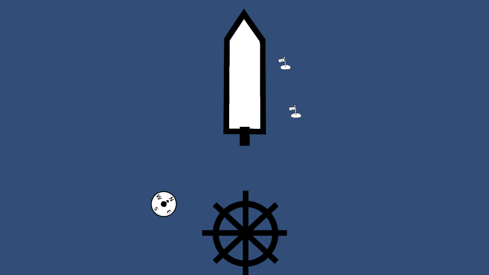
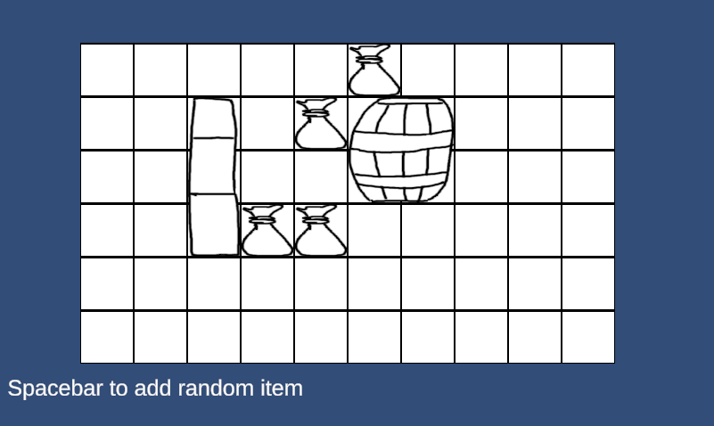
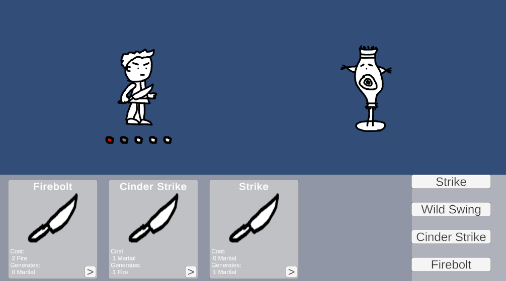
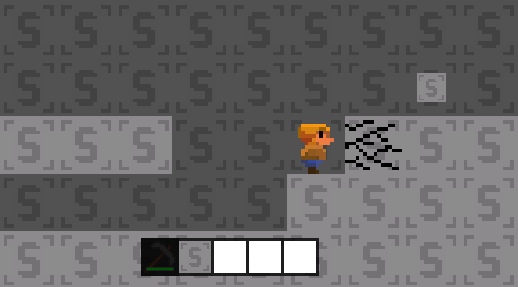

# Unity Prototypes

## Sailing Topdown 2D

Camera is locked to ship, use mouse to turn steering wheel and navigate. Points of Interest off screen are identified using a circular HUD around the ship.

## Tetris Inventory

ARPG style inventory. Different items take up multiple slots and can be moved around with the mouse.

## Idle Combat

Implementation of a combat system inspired by [this video](https://www.youtube.com/watch?v=LY9wqkzauz4) by Polatrite.

Abilities can be generators and/or spenders. Character attempts to activate each ability in sequence each "turn".

## Dwarf Game

Old 2019 Project. Side on block game. Uses raycasts for collision detection. Has block breaking/placement and inventory.

## Invaders
Old 2018 Space Invaders Clone - Trying different implementations for upgrades/scoring/etc.

## Voxel Sidescroll
Old 2D Block Game prototype

## Voxel Tutorials
Old Repo for my progress following various voxel tutorials and similar experiments

Links to tutorials used in this repo:  
http://studentgamedev.blogspot.com.au  
http://alexstv.com/index.php/posts/unity-voxel-block-tutorial  

## Fluid Turns
Prototyping a turn based game that runs in real time

## Utility AI
Prototyping 2D RTS style AI combat